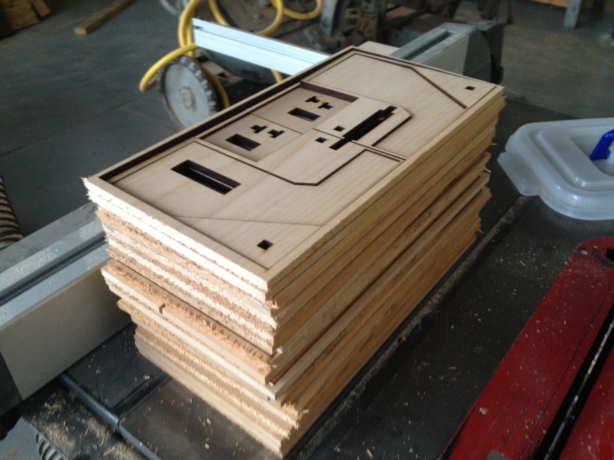
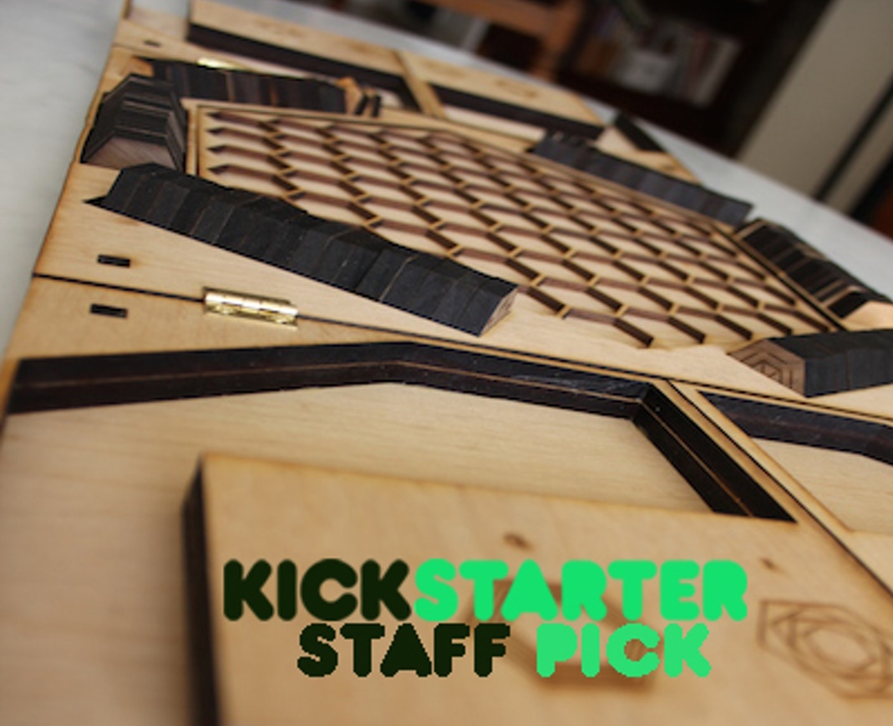

Tabula is a wooden board game that was successfully funded on Kickstarter 16,000$. Completed with Duncan Abbot. 

Made entirely of wood and designed to be self-contained, Tabula is its own box. The game closes in on itself to become an sleek tabula, "tablet" in Latin.  The name Tabula  also comes from "Tabula Rasa", meaning "blank slate" - the board starts as a blank slate that then becomes filled with the tiles. 

Tabula is a a casual turn-based strategy game for two players in which the objective is to occupy the most spaces of the board. In this game, each player has access to four different type of special tiles that have unique abilities: Attack, Defense, Expansion, Jump. The game-play consists of playing either 1 special tile or two regular tiles (that have no abilities). The game ends when all the spaces of the board have been filled. Whoever has placed the most tiles is the winner!

<ul>
<li></li>
<li></li>
<li></li>
<li></li>
</ul>

For original Kickstarter page:
https://www.kickstarter.com/projects/182736998/tabula-the-game
